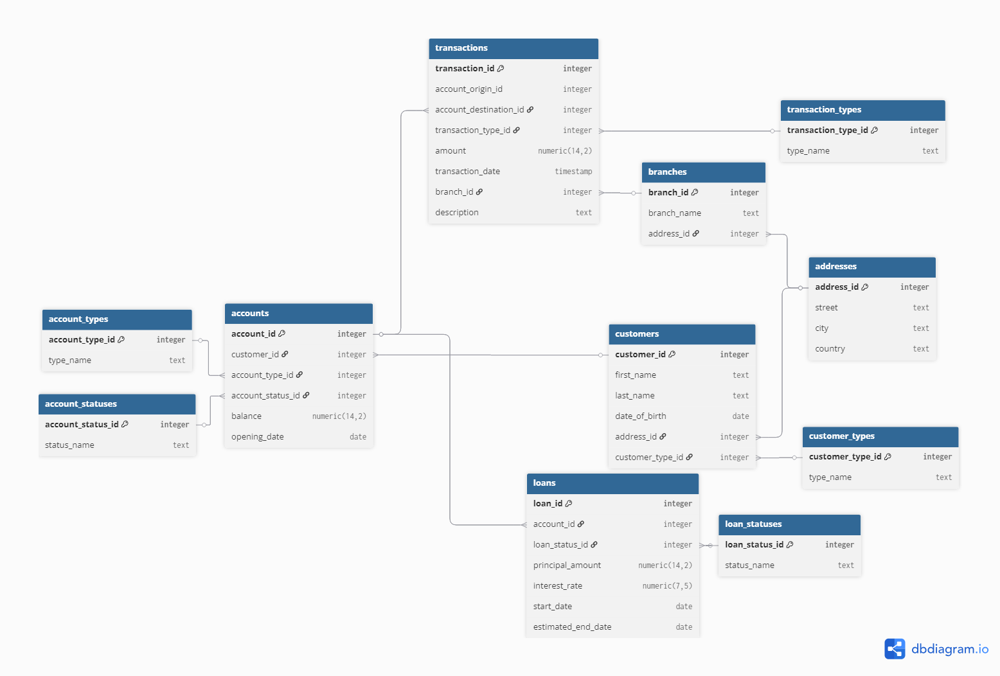

# D-Vision

## Overview
This project demonstrates how to build a small analytics pipeline using a **synthetic financial dataset** that simulates a banking system.  
The dataset includes **50k+ rows** across multiple related tables:

- **Customers**  
- **Accounts**  
- **Loans**  
- **Transactions**  
- **Reference tables** (loan statuses, account types, etc.)

The dataset: https://www.kaggle.com/datasets/testdatabox/finance-fraud-and-loans-dataset-testdatabox

You can read more about dataset in `dataset/readme.md`

## ER Diagram



## Requirements
- Python 3.10+
- PostgreSQL (local or remote server)

## Installation
1. Clone the repository:
```bash
git clone https://github.com/1tzme/d-vision
cd https://github.com/1tzme/d-vision
```

2. Create and activate a virtual environment:
- Linux / macOS:
```bash
python3 -m venv venv
source venv/bin/activate
```
- Windows (PowerShell):
```powershell
python -m venv venv
.\venv\Scripts\Activate.ps1
```

3. Install dependencies:
```bash
pip install -r requirements.txt
```

## Environment Setup

1. Copy `.env.example` to `.env`:
```bash
cp .env.example .env
```

2. Open `.env` and fill in your credentials:
```ini
DB_NAME = finance
DB_USER = your user name
DB_PASSWORD = your user password
DB_HOST = localhost
```

## Starting PostgreSQL
If PostgreSQL is installed locally, make sure the service is running:

- Linux (systemd):
```bash
sudo systemctl start postgresql
sudo systemctl status postgresql
```

- Windows: start it via pgAdmin or `Services -> PostgreSQL -> Start`.

## Running the Script
After configuring `.env` and ensuring PostgreSQL is running, execute:
```bash
python main.py
```

# Made by [1tzme](https://github.com/1tzme)